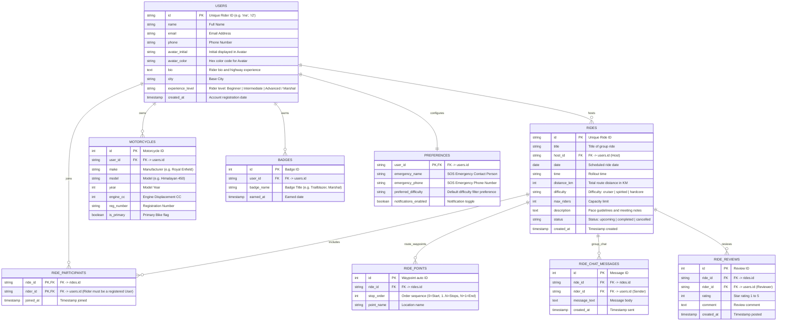

# GET ALONG Data Model & Database Architecture Specification

This document defines the complete **PostgreSQL Relational Data Model** for the GET ALONG motorcycle group ride application.

---

## 1. Entity-Relationship (ER) Diagram



---

## 2. SQL Schema DDL Definitions

```sql
-- Database: getalong_db (PostgreSQL 14+)

CREATE TABLE IF NOT EXISTS users (
  id VARCHAR(50) PRIMARY KEY,
  name VARCHAR(100) NOT NULL,
  email VARCHAR(150),
  phone VARCHAR(20),
  avatar_initial VARCHAR(5) DEFAULT 'A',
  avatar_color VARCHAR(20) DEFAULT '#F2B705',
  bio TEXT,
  city VARCHAR(100) DEFAULT 'Chennai',
  experience_level VARCHAR(50) DEFAULT 'Intermediate',
  created_at TIMESTAMP DEFAULT CURRENT_TIMESTAMP
);

CREATE TABLE IF NOT EXISTS rides (
  id VARCHAR(50) PRIMARY KEY,
  title VARCHAR(150) NOT NULL,
  host_id VARCHAR(50) REFERENCES users(id) ON DELETE CASCADE,
  date DATE NOT NULL,
  time VARCHAR(30) NOT NULL,
  distance_km INTEGER,
  difficulty VARCHAR(30) DEFAULT 'cruiser',
  max_riders INTEGER DEFAULT 8,
  description TEXT,
  status VARCHAR(30) DEFAULT 'upcoming',
  created_at TIMESTAMP DEFAULT CURRENT_TIMESTAMP
);

CREATE TABLE IF NOT EXISTS ride_points (
  id SERIAL PRIMARY KEY,
  ride_id VARCHAR(50) REFERENCES rides(id) ON DELETE CASCADE,
  stop_order INTEGER NOT NULL,
  point_name VARCHAR(150) NOT NULL
);

CREATE TABLE IF NOT EXISTS ride_participants (
  ride_id VARCHAR(50) REFERENCES rides(id) ON DELETE CASCADE,
  rider_id VARCHAR(50) REFERENCES users(id) ON DELETE CASCADE,
  joined_at TIMESTAMP DEFAULT CURRENT_TIMESTAMP,
  PRIMARY KEY (ride_id, rider_id)
);

CREATE TABLE IF NOT EXISTS ride_chat_messages (
  id SERIAL PRIMARY KEY,
  ride_id VARCHAR(50) REFERENCES rides(id) ON DELETE CASCADE,
  rider_id VARCHAR(50) REFERENCES users(id) ON DELETE CASCADE,
  message_text TEXT NOT NULL,
  created_at TIMESTAMP DEFAULT CURRENT_TIMESTAMP
);

CREATE TABLE IF NOT EXISTS ride_reviews (
  id SERIAL PRIMARY KEY,
  ride_id VARCHAR(50) REFERENCES rides(id) ON DELETE CASCADE,
  rider_id VARCHAR(50) REFERENCES users(id) ON DELETE CASCADE,
  rating INTEGER CHECK (rating >= 1 AND rating <= 5),
  comment TEXT,
  created_at TIMESTAMP DEFAULT CURRENT_TIMESTAMP
);

CREATE TABLE IF NOT EXISTS motorcycles (
  id SERIAL PRIMARY KEY,
  user_id VARCHAR(50) REFERENCES users(id) ON DELETE CASCADE,
  make VARCHAR(50) NOT NULL,
  model VARCHAR(100) NOT NULL,
  year INTEGER,
  engine_cc INTEGER,
  reg_number VARCHAR(30),
  is_primary BOOLEAN DEFAULT false,
  created_at TIMESTAMP DEFAULT CURRENT_TIMESTAMP
);

CREATE TABLE IF NOT EXISTS badges (
  id SERIAL PRIMARY KEY,
  user_id VARCHAR(50) REFERENCES users(id) ON DELETE CASCADE,
  badge_name VARCHAR(100) NOT NULL,
  earned_at TIMESTAMP DEFAULT CURRENT_TIMESTAMP
);

CREATE TABLE IF NOT EXISTS preferences (
  user_id VARCHAR(50) PRIMARY KEY REFERENCES users(id) ON DELETE CASCADE,
  emergency_name VARCHAR(100),
  emergency_phone VARCHAR(20),
  preferred_difficulty VARCHAR(30) DEFAULT 'cruiser',
  notifications_enabled BOOLEAN DEFAULT true
);
```

---

## 3. REST API Contract Endpoints

| Method | Endpoint | Description | Auth Required |
| :--- | :--- | :--- | :--- |
| `GET` | `/api/rides` | List all upcoming/active rides with host details, route waypoints, and current rider count. | No (Guest allowed) |
| `GET` | `/api/rides/:id` | Fetch full details for a single ride (route stops, rider list, chat messages, reviews). | No (Guest allowed) |
| `POST` | `/api/rides` | Create a new ride and route waypoints. Auto-joins host as participant. | Yes (Registered User) |
| `POST` | `/api/rides/:id/join` | Toggle join / leave status for a ride. Enforces foreign key constraint to `users.id`. | Yes (Registered User) |
| `POST` | `/api/rides/:id/chat` | Send group chat message to a ride. | Yes (Registered User) |
| `POST` | `/api/rides/:id/reviews` | Submit a review for a completed ride. | Yes (Registered User) |
| `GET` | `/api/riders` | Fetch all rider profiles. | No (Guest allowed) |
| `GET` | `/api/riders/:id` | Fetch rider profile, hosted rides, joined rides, badges, and received reviews. | No (Guest allowed) |
| `GET` | `/api/account` | Fetch current logged-in user profile, motorcycles, badges, and preferences. | Yes (Registered User) |
| `PUT` | `/api/account/profile` | Update profile information. | Yes (Registered User) |
| `POST` | `/api/account/bikes` | Add motorcycle to garage. | Yes (Registered User) |
| `PUT` | `/api/account/bikes/:id` | Update motorcycle / set primary. | Yes (Registered User) |
| `DELETE` | `/api/account/bikes/:id` | Delete motorcycle. | Yes (Registered User) |
| `PUT` | `/api/account/preferences` | Update safety contact & preferences. | Yes (Registered User) |
