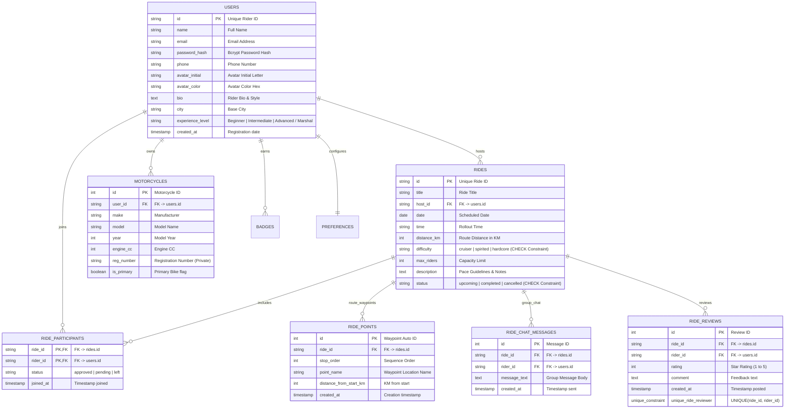

# GET ALONG - Comprehensive System Architecture & Technical Documentation

> **Prepared for Technical / Gen AI Advisor Review**  
> **Repository**: `GetAlong`  
> **Stack**: React 19 • Vite 6 • Tailwind CSS v4 • Express.js • PostgreSQL (`localhost:5432`)  
> **Status**: Gap Remediation & Hardening Complete

---

## 1. Executive Summary & Project Vision

**GET ALONG** is a full-stack mobile-first web application engineered for motorcycle enthusiasts to discover, organize, and participate in group rides. Following the **Gen AI Advisor Architecture Gap Analysis**, the application has been hardened with **JWT Authentication Middleware**, database schema constraints, timestamps, composite unique indexes, privacy controls for sensitive PII/SOS contacts, and composite query indexes.

---

## 2. Technology Stack & Security Architecture

```mermaid
graph TD
    Client["React 19 Frontend (Vite port 3000)"] -->|JWT Bearer Token /api| Express["Express API Server (port 5000)"]
    Express -->|requireAuth Middleware| AuthModule["Auth Router (/api/auth)"]
    Express -->|pg Pool Connection| Postgres["PostgreSQL DB (localhost:5432 / getalong_db)"]
    
    subgraph Frontend Subsystems
        Feed["Rides Feed & Difficulty Filters"]
        Details["Ride Logistics, Route Strip, Chat & Reviews"]
        HostForm["Host a Ride (Dynamic Waypoints)"]
        MyAccount["MyAccount (Profile, Garage & Emergency SOS)"]
        ThemeSystem["ThemeContext (Day & Night Modes)"]
    end

    Client --> Frontend Subsystems
```

### Core Security & Framework Features

- **Authentication**: JWT (`jsonwebtoken`) token derivation on server side with `requireAuth` middleware for all write actions (`POST /api/rides`, `POST /api/rides/:id/join`, `POST /api/rides/:id/chat`, `POST /api/rides/:id/reviews`, `PUT /api/account/*`). Passwords hashed with `bcryptjs`.
- **Frontend**: React 19, Lucide React Icons (`^1.16.0`), Tailwind CSS v4 (`@tailwindcss/vite`), Custom CSS Keyframe Animations.
- **Backend API**: Express.js `4.21.2`, `cors`, `dotenv`, `jsonwebtoken`, `bcryptjs`.
- **Database**: PostgreSQL on `localhost:5432` (`getalong_db`) with automated schema migrations, indexes, constraints, and seed data.

---

## 3. Database Schema & Data Model (Hardened)



---

## 4. Remediation Highlights (Advisor Gap Analysis)

| Gap Identified | Status | Remediation Implemented |
| :--- | :--- | :--- |
| **Missing Authentication** | ✅ **Fixed** | Implemented `server/middleware/auth.js` (`requireAuth`) & `server/routes/auth.js` (`/register`, `/login`, `/me`). Derives acting user ID from verified JWT Bearer tokens. |
| **Timestamps & Message Ordering** | ✅ **Fixed** | Added `created_at TIMESTAMP DEFAULT CURRENT_TIMESTAMP` to `ride_points`, `ride_chat_messages`, `ride_reviews`, and `users`. |
| **Duplicate Ride Reviews** | ✅ **Fixed** | Added `CONSTRAINT unique_ride_reviewer UNIQUE (ride_id, rider_id)` on `ride_reviews` table. |
| **Participant Status Column** | ✅ **Fixed** | Added `status VARCHAR(30) DEFAULT 'approved'` (`approved \| pending \| left`) to `ride_participants`. |
| **Waypoint Distance Metric** | ✅ **Fixed** | Added `distance_from_start_km INTEGER DEFAULT 0` to `ride_points`. |
| **Sensitive PII & SOS Privacy** | ✅ **Fixed** | Omitted `phone`, `email`, `reg_number`, and `emergency_phone` from public `/api/riders` endpoints; restricted read access strictly to authenticated profile owner. |
| **High-Frequency Query Indexes** | ✅ **Fixed** | Added composite indexes `idx_rides_status_date`, `idx_participants_rider`, and `idx_chat_messages_ride`. |

---

## 5. REST API Contract Specification

| Method | Endpoint | Description | Auth Requirement |
| :--- | :--- | :--- | :--- |
| `POST` | `/api/auth/register` | Register new rider account and receive JWT token. | Public |
| `POST` | `/api/auth/login` | Authenticate existing rider and receive JWT token. | Public |
| `GET` | `/api/auth/me` | Fetch active user session. | `Bearer <token>` |
| `GET` | `/api/rides` | Fetch all group rides with route waypoints, host info, and participants. | Public / Guest |
| `POST` | `/api/rides` | Create a new group ride. | `Bearer <token>` |
| `POST` | `/api/rides/:id/join` | Toggle join / leave status. | `Bearer <token>` |
| `POST` | `/api/rides/:id/chat` | Send group chat message. | `Bearer <token>` |
| `POST` | `/api/rides/:id/reviews` | Post a star review and comment (enforces composite unique index). | `Bearer <token>` |
| `GET` | `/api/account` | Fetch logged-in user profile, garage motorcycles, badges, and SOS preferences. | `Bearer <token>` |
| `PUT` | `/api/account/profile` | Update profile information. | `Bearer <token>` |
| `POST` | `/api/account/bikes` | Add motorcycle to garage. | `Bearer <token>` |
| `PUT` | `/api/account/bikes/:id` | Update motorcycle details / set primary bike. | `Bearer <token>` |
| `DELETE` | `/api/account/bikes/:id` | Delete motorcycle from garage. | `Bearer <token>` |
| `PUT` | `/api/account/preferences` | Save safety emergency contact details. | `Bearer <token>` |
